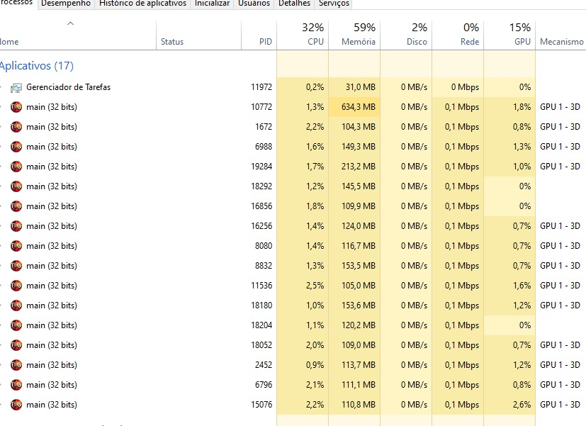

# Mu Helpless Desktop

Helpless was created to improve PC performance for Mu Online players.

This WILL:
- Manage Mu processes to optimize CPU/GPU usage when running multiple instances.
- Access windows installation information to generate the installation code.

This WILL NOT:
- Install or modify any other software outside of selected installation folder.
- Collect any user information or activity.
- Read or change any Mu communication with server.

Possible scenario without Switch Scroll:

